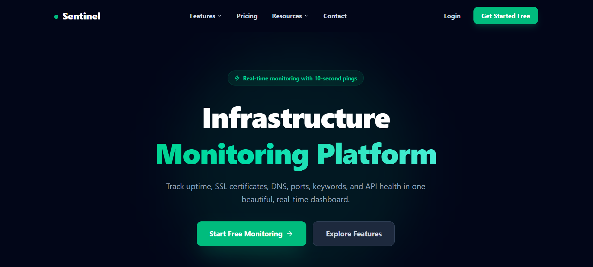

# 🖥️ Sentinel – Uptime Monitoring Frontend

A modern, responsive, and high-performance frontend for the **Sentinel Uptime Monitoring Platform**, built with **React**, **Vite**, and **Tailwind CSS**. Sentinel provides a clean and intuitive interface for monitoring websites, APIs, SSL certificates, DNS records, ports, and infrastructure health from a single dashboard.

🌐 **Live Demo:** https://client-uptime-frontend.vercel.app/

---

# 📖 Overview

**Sentinel** is a cloud-ready infrastructure monitoring platform that enables developers and organizations to monitor the health and availability of their services in real time.

The frontend is built with **React + Vite** for blazing-fast performance and **Tailwind CSS** for a modern UI. It seamlessly integrates with a secure **Spring Boot Microservices** backend powered by **OAuth2**, **JWT Authentication**, **Spring Cloud Gateway**, **Eureka Service Discovery**, and **Config Server**.

---

# 📸 Screenshots

## 🏠 Landing Page



> Modern landing page featuring real-time infrastructure monitoring, API health checks, SSL certificate monitoring, DNS monitoring, and secure authentication.

---

# ✨ Features

- 🚀 Modern & Responsive Landing Page
- 🔐 Google OAuth2 Authentication
- 🛡️ JWT Secure Authentication
- 📊 Interactive Monitoring Dashboard
- 🌐 Website Uptime Monitoring
- ⚡ REST API Monitoring
- 🔒 SSL Certificate Monitoring
- 🌍 DNS Monitoring
- 🔌 Port Monitoring
- 📈 Response Time Analytics
- 📉 Uptime Statistics
- 📱 Fully Responsive Design
- 🎨 Beautiful UI with Tailwind CSS
- ⚡ Fast Performance with Vite
- 🔄 REST API Integration
- 🌙 Dark Theme
- ☁️ Cloud Deployment Ready

---

# 🚀 Highlights

- ⚡ Real-time monitoring with 10-second health checks
- 🌐 Website & REST API monitoring
- 🔒 SSL certificate expiration tracking
- 🌍 DNS monitoring
- 🔌 Port availability monitoring
- 📊 Modern analytics dashboard
- 🔐 Google OAuth2 Authentication
- 📱 Mobile-first responsive design
- 🌙 Beautiful dark interface
- ☁️ Hosted on Vercel

---

# 🛠️ Tech Stack

| Category | Technology |
|------------|------------|
| Framework | React 19 |
| Build Tool | Vite |
| Styling | Tailwind CSS |
| Routing | React Router DOM |
| HTTP Client | Axios |
| Authentication | Google OAuth2 + JWT |
| Icons | Lucide React |
| Linting | ESLint |
| Deployment | Vercel |

---

# 📂 Project Structure

```text
client-uptime-frontend/

├── public/
│
├── src/
│   ├── assets/
│   │   └── images/
│   │       └── homepage.png
│   │
│   ├── components/
│   ├── pages/
│   ├── layouts/
│   ├── hooks/
│   ├── context/
│   ├── services/
│   ├── routes/
│   ├── utils/
│   ├── App.jsx
│   └── main.jsx
│
├── index.html
├── package.json
├── vite.config.js
├── eslint.config.js
├── vercel.json
└── README.md
```

---

# 🚀 Getting Started

## Clone the Repository

```bash
git clone https://github.com/jhachhotu/client-uptime-frontend.git

cd client-uptime-frontend
```

---

## Install Dependencies

```bash
npm install
```

---

## Configure Environment Variables

Create a `.env` file in the project root.

```env
VITE_API_URL=http://localhost:8080

VITE_GOOGLE_CLIENT_ID=your_google_client_id
```

---

## Start Development Server

```bash
npm run dev
```

The application will start at:

```text
http://localhost:5173
```

Vite provides an extremely fast development experience with Hot Module Replacement (HMR), enabling instant updates while developing.

---

# 📦 Production Build

Build the project:

```bash
npm run build
```

Preview the production build locally:

```bash
npm run preview
```

The optimized production build is generated inside the **dist/** folder and is ready to deploy on platforms like Vercel, Netlify, Firebase Hosting, GitHub Pages, or AWS S3.

---

# 🌐 Live Demo

The application is deployed on **Vercel**.

### 🔗 Live Website

https://client-uptime-frontend.vercel.app/

---

# 🎯 Core Features

## 🔐 Authentication

- Google OAuth2 Login
- JWT Authentication
- Secure Session Management
- Protected Routes

---

## 📊 Monitoring Dashboard

- Website Monitoring
- API Monitoring
- SSL Certificate Status
- DNS Monitoring
- Port Monitoring
- Response Time Analytics
- Uptime Statistics

---

## 🎨 User Experience

- Responsive Design
- Smooth Navigation
- Modern Components
- Beautiful Animations
- Mobile Friendly
- Dark Theme
- Fast Loading Pages

---

# 🎨 UI Highlights

- Modern SaaS Landing Page
- Beautiful Hero Section
- Responsive Navigation Bar
- Interactive Call-to-Action Buttons
- Professional Typography
- Reusable React Components
- Optimized User Experience
- Clean Dashboard Layout

---

# ⚡ Performance

- ⚡ Fast Page Loading
- 🚀 Optimized Bundling with Vite
- 📦 Component-Based Architecture
- 🔄 Efficient REST API Calls
- 💾 Lazy Loading Ready
- 🔥 Hot Module Replacement (HMR)

---

# 🔗 Backend Integration

The frontend communicates with the **Sentinel Uptime Monitoring Backend**, which is built using:

- Spring Boot
- Spring Security
- OAuth2 Authentication
- JWT Authorization
- Spring Cloud Gateway
- Eureka Service Registry
- Spring Cloud Config Server
- Docker
- Microservices Architecture
- REST APIs

---

# 🚀 Deployment

The frontend is deployed on **Vercel**.

To deploy your own instance:

```bash
npm run build
```

Deploy the generated **dist/** folder to:

- ▲ Vercel
- Netlify
- Firebase Hosting
- GitHub Pages
- AWS S3
- Cloudflare Pages

---

# 📈 Future Enhancements

- 📧 Email Notifications
- 📱 Push Notifications
- 📩 SMS Alerts
- 🌙 Light/Dark Theme Toggle
- 👥 Team Collaboration
- 📊 Advanced Analytics Dashboard
- 📈 Interactive Charts
- 🔔 Real-time WebSocket Updates
- 🌍 Multi-language Support
- 👤 User Preferences
- 📤 Export Monitoring Reports

---

# 🤝 Contributing

Contributions are always welcome!

1. Fork the repository

2. Create a feature branch

```bash
git checkout -b feature/new-feature
```

3. Commit your changes

```bash
git commit -m "Add new feature"
```

4. Push your changes

```bash
git push origin feature/new-feature
```

5. Open a Pull Request

---

# 📄 License

This project is licensed under the **MIT License**.

---

# 👨‍💻 Author

**Chhotu Kumar**

🔗 **GitHub:** https://github.com/jhachhotu

🔗 **LinkedIn:** https://www.linkedin.com/in/kumarchhotu/

---

## ⭐ Support

If you found this project useful, please consider giving it a **⭐ Star** on GitHub. Your support helps improve the project and makes it easier for others to discover it.

Happy Coding! 🚀
